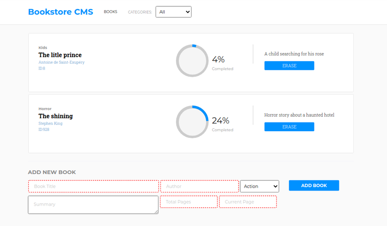

<!-- PROJECT SHIELDS -->

[![Forks][forks-shield]][forks-url]
[![Stargazers][stars-shield]][stars-url]
[![Issues-open][issues-open-shield]][issues-url]
[![Issues-closed][issues-closed-shield]][issues-url]
[![Contributors][contributors-shield]][contributors-url]
[![Framework][badge-framework]][framework-url]
[![contributions welcome][contributions-welcome]][issues-url]

<!-- PROJECT LOGO -->
<br />
<p align="center">
  <a href="https://www.microverse.org/">
    
  </a>

  <h1 align="center">
	  Bookstore CMS
  </h1>

  <p align="center">
    A fully-functional, fast, dynamic, responsive but also beautiful and user-friendly bookstore management tool
    <br />
	  🖊️
    <a href="https://github.com/microverseinc/project-redux-bookstore">Assignment</a>
    🐞
    <a href="https://github.com/mcastorena0316/Bookstore_CMS/issues">Report a Bug</a>
    🙋‍♂️
    <a href="https://github.com/mcastorena0316/Bookstore_CMS/issues">Request Feature</a>
  </p>
</p>

## Table of Contents

- [Live Demo [here][demo]](#live-demo-here)
- [Specifications](#specifications)
  - [The Project](#the-project)
- [Features](#features)
- [Built With](#built-with)
- [How to run this project](#how-to-run-this-project)
  - [Prerequisites](#prerequisites)
  - [Installing the project](#installing-the-project)
  - [Available Scripts](#available-scripts)
    - [`npm start`](#npm-start)
    - [`npm run build`](#npm-run-build)
  - [Learn More](#learn-more)
- [Authors](#authors)
- [Contributing](#contributing)
- [Show your support](#show-your-support)
- [License](#license)

# Live Demo [here][demo]

[][demo]

# Specifications

## The Project

Magic-books Inc. is a fictional company based in Germany. They have requested help to build the front-end of an application that will help them organize and manage their bookstore. They want it to be fast, dynamic and responsive to their actions and therefore we decided to build it with React & Redux.

- Linters
- React
- React-DOM
- React-Create-App
- Redux
- PropTypes
- ES6 syntax
- Export/import ES6+ notation

# Features

- Basic `create-react-app` structure
- Sets `stickler` on the repo
- Sets `eslint` rules

## `ESlint` test


# Built With

- `create-react-app`
- `ESLint`
- `npm`
- `vscode` with _ESLint_ extension
- Linux/GNU
- Love and Passion for code

# How to run this project

We used `create-react-app` to initialize this project, so it is configurated to be easy to run. Just follow this instructions.

## Prerequisites

- `npm` 6.13 +
- `node` 11.15 +
- A Text Editor like VSCode
- A browser like Firefox or Chrome

## Installing the project

Now that you are set up, open a terminal and:

```
git clone https://github.com/mcastorena0316/Bookstore_CMS.git
cd Bookstore_CMS
npm i && npm start
```

Then open [http://localhost:3000/](http://localhost:3000/) to see the app.

## Available Scripts

In the project directory, you can run:

### `npm start`

Runs the app in the development mode.<br />
Open [http://localhost:3000](http://localhost:3000) to view it in the browser.

The page will reload if you make edits.<br />
You will also see any lint errors in the console.

### `npm run build`

Builds the app for production to the `build` folder.<br />
It correctly bundles React in production mode and optimizes the build for the best performance.

The build is minified and the filenames include the hashes.<br />
Your app is ready to be deployed!

See the section about [deployment](https://facebook.github.io/create-react-app/docs/deployment) for more information.

## Learn More

You can learn more in the [Create React App documentation](https://facebook.github.io/create-react-app/docs/getting-started).

To learn React, check out the [React documentation](https://reactjs.org/).

# Authors

<table style="width:100%">
  <tr>
    <td>
      <div align="center">
        <a href="[./docs/img/photo.png](https://github.com/mcastorena0316)" target="_blank" rel="author">
          
        </a>
        <h2>
          <a href="https://mcastorena0316.github.io/portfolio/" target="_blank" rel="author">
              Melissa Castorena
          </a>
        </h2>
      </div>
    </td>
    <td>
      <div align="center">
        <a href="https://www.linkedin.com/in/melissa-castorena/">
          
          <h3>
              Connect to my Linkedin
          </h3>
        </a>
      </div>
    </td>
  </tr>
  <tr>
    <td>
        <div align="center">
            <a href="./docs/img/photo.png" target="_blank" rel="author">
                
            </a>
            <h2>
                <a href="https://israellaguan.com/" target="_blank" rel="author">
                    Israel Laguan
                </a>
            </h2>
        </div>
    </td>
    <td>
        <div align="center">
            <a href="mailto:israellaguan@gmail.com" target="_blank" rel="author">
                
                <h3>
                    Email me to 
                    <a href="mailto:israellaguan@gmail.com">
                        israellaguan@gmail.com
                    </a>
                </h3>
            </a>
            <a href="https://www.linkedin.com/in/israellaguan/" target="_blank" rel="author">
                
                <h3>
                    Connect to my Linkedin
                </h3>
            </a>
            <a href="https://github.com/Israel-Laguan" target="_blank" rel="author">
                
                <h3>
                    Check my GitHub Profile
                </h3>
            </a>
        </div>
    </td>
  </tr>
</table>

# Contributing

[![contributions welcome][contributions-welcome]][issues-url]

🤝 Contributions, issues and feature requests are welcome!
Feel free to check the [issues page][issues-url].

# Show your support

🤗 Give a ⭐️ if you like this project!

Icons from:

<a href="https://icons8.com/icon/13917/full-image">Icons8</a>

# License

[![License][badge-license]](http://badges.mit-license.org)

📝 This project is licensed under the [MIT](LICENSE)\
Feel free to fork this project and improve it

<!-- MARKDOWN LINKS & IMAGES -->

[contributors-shield]: https://img.shields.io/github/contributors/mcastorena0316/Bookstore_CMS?style=for-the-badge
[contributors-url]: https://github.com/mcastorena0316/Bookstore_CMS/graphs/contributors
[forks-shield]: https://img.shields.io/github/forks/mcastorena0316/Bookstore_CMS?style=for-the-badge
[forks-url]: https://github.com/mcastorena0316/Bookstore_CMS/network/members
[stars-shield]: https://img.shields.io/github/stars/mcastorena0316/Bookstore_CMS?style=for-the-badge
[stars-url]: https://github.com/mcastorena0316/Bookstore_CMS/stargazers
[issues-open-shield]: https://img.shields.io/github/issues/mcastorena0316/Bookstore_CMS?style=for-the-badge
[issues-url]: https://github.com/mcastorena0316/Bookstore_CMS/issues
[issues-closed-shield]: https://img.shields.io/github/issues-closed/mcastorena0316/Bookstore_CMS?style=for-the-badge
[badge-framework]: https://img.shields.io/badge/framework-react-9cf?style=for-the-badge
[framework-url]: https://reactjs.org/
[contributions-welcome]: https://img.shields.io/badge/contributions-welcome-brightgreen.svg?style=for-the-badge
[badge-license]: https://img.shields.io/:license-mit-blue.svg?style=for-the-badge
[demo]: https://bookstorecms.herokuapp.com/
